# CHIRAG FLOWSCAPE — Fluid Contact Detector

> **An uncertainty-aware Excel dashboard for screening formation-level fluid contacts in heterogeneous reservoirs.**

[](#)
[](#)
[](#)
[](LICENSE)

## What this project does

The **Fluid Contact Detector** converts formation-by-well fluid observations into a transparent screening workflow for:

- **GOC** — Gas–Oil Contact
- **OWC** — Oil–Water Contact
- **GWC** — Gas–Water Contact
- transition intervals where a sharp contact should **not** be forced
- candidate contact TVD
- uncertainty envelopes
- saturation-consistency checks
- per-well contact summaries
- dashboard-level QC

The design follows the research concept that fluid contacts should remain **formation-specific and uncertainty-aware**, rather than being forced into one common field-wide contact.

## Research connection

This tool is part of the **CHIRAG FLOWSCAPE** research framework for heterogeneous fluvio-deltaic reservoirs.

The research framework integrates:

**stratigraphy → fluid contacts → petrophysics → permeability → uncertainty → connectivity → dynamic evidence → ML calibration**

The current workbook deliberately stops short of claiming dynamic connectivity. Pressure/rate and 4D observations are intended as a future independent evidence layer.

## Repository structure

```text
chirag-fluid-contact-detector/
│
├── Fluid_Contact_Detector_CHIRAG.xlsx   # Main interactive workbook
│
├── docs/
│   └── methodology.md                   # Technical methodology
│
├── data/
│   └── README.md                        # Data and confidentiality guidance
│
├── .github/
│   └── workflows/
│       └── validate.yml                 # Basic repository validation
│
├── LICENSE
├── requirements.txt
├── .gitignore
└── README.md
```

## Dashboard workflow

```mermaid
flowchart LR
    A[Formation-by-well data] --> B[Fluid classification]
    B --> C[Top / base TVD]
    C --> D[Candidate fluid transition]
    D --> E[Contact uncertainty envelope]
    E --> F[Sw consistency check]
    F --> G[Screening score]
    G --> H[Per-well contact summary]
    H --> I[Future dynamic update]
    I --> J[Bayesian connectivity / ML calibration]
```



## Workbook tabs

### 1. Dashboard
A quick project-level view of:

- number of input records
- direct contact candidates
- transition intervals
- Sw conflicts
- candidate OWC distribution

### 2. Master_Data
The original master spreadsheet is preserved and extended with research-specific fields.

Key inputs include:

| Field | Purpose |
|---|---|
| Well | Well identifier |
| Formation | Stratigraphic interval |
| TVD_SCS | Formation depth reference |
| PHIT | Porosity |
| Av_PERM | Average permeability |
| Sw | Water saturation |
| Gross TST | Original thickness reference |
| TST-S | Optional shifted thickness |
| NTG | Net-to-gross |
| Net Rock / Net Reservoir / Net Pay | Effective reservoir thickness |
| Fluids | Observed fluid description |
| Fluid Override | Manual classification when required |

### 3. Contact_Detector

The detector evaluates adjacent formation intervals within each well.

It reports:

- contact type
- candidate TVD
- uncertainty
- low/high uncertainty bounds
- upper/lower Sw
- ΔSw
- saturation consistency
- screening score
- evidence flag
- interpretation/action

### 4. Contact_Summary

Provides per-well:

- GOC count and TVD statistics
- OWC count and TVD statistics
- GWC count and TVD statistics
- P10 / P50 / P90-style screening summaries where sufficient candidates exist

### 5. Settings

The principal screening assumptions are editable.

Default screening envelope:

\[
U_{contact} = \max(5m,\;0.03 \times h_{effective})
\]

This is a **screening assumption**, not a calibrated field uncertainty.

### 6. Methodology

Provides traceability between the workbook calculations and the research framework.

---

# Detection logic

## Fluid classification

The workbook parses the supplied fluid description into:

- `GAS`
- `OIL`
- `OIL_WATER`
- `GAS_WATER`
- `WATER`
- `UNKNOWN`

A manual `Fluid_Override` field is available when automated text classification is inappropriate.

## Candidate contact logic

Examples:

```text
GAS → OIL       = candidate GOC
OIL → WATER     = candidate OWC
GAS → WATER     = candidate GWC
OIL → OIL_WATER = transition interval
OIL_WATER → WATER = transition interval
```

The tool does **not** automatically convert every mixed-fluid observation into a sharp contact.

## Uncertainty

Candidate contacts are accompanied by an uncertainty envelope rather than a single supposedly exact depth.

The current screening implementation uses:

```text
MAX(5 m, 3% × effective thickness)
```

The research framework recommends replacing this with uncertainty derived from:

- seismic picking
- log correlation
- structural depth conversion
- pressure/contact calibration
- approved field data

## Sw diagnostic

For a candidate downward fluid transition, the tool checks whether the lower interval has greater/equal Sw than the upper interval.

A conflict is flagged as:

```text
SW_CONFLICT
```

This is a **diagnostic signal**, not proof that the contact interpretation is wrong.

---

# Why this is different from a simple contact picker

A conventional contact picker can answer:

> "Where is the contact?"

This tool is designed to ask:

> **"What is the candidate contact, how uncertain is it, and what independent evidence supports or conflicts with it?"**

That distinction matters in heterogeneous fluvio-deltaic reservoirs where:

- sand bodies vary laterally
- mudstone can create baffles
- permeability varies strongly
- contacts may shift with interpretation uncertainty
- saturation can change through transition zones
- static continuity does not automatically prove hydraulic communication

---

# Planned research extensions

The current workbook is the **fluid-contact layer** of the broader research architecture.

Future modules can add:

### Dynamic Connectivity Index

\[
DCI_{ij}=w_GC_G+w_SC_S+w_PC_P+w_DC_D
\]

with:

\[
\sum w = 1
\]

### Bayesian update

\[
P(C_{ij}|D)=
\frac{P(D|C_{ij})P(C_{ij})}{P(D)}
\]

where dynamic pressure, production, injection or 4D evidence can update the static prior.

### Static–dynamic mismatch

\[
M_{ij}=C_{static,ij}-C_{dynamic,ij}
\]

Potential positive mismatch hypotheses include:

- shale baffles
- sub-seismic faults
- permeability barriers
- incorrect contacts
- correlation error

Potential negative mismatch hypotheses include:

- transmissible faults
- thin connected sands
- underestimated permeability
- overly restrictive facies interpretation

### Monte Carlo uncertainty

Future versions can simultaneously perturb:

- contact depth
- formation thickness
- permeability
- NTG
- fault transmissibility
- shale continuity
- DCI weights
- dynamic-response thresholds

and report connectivity P10/P50/P90 plus sensitivity ranking.

### Physics-informed ML

The eventual objective is to connect:

```text
fluid contacts
     ↓
reservoir quality
     ↓
connectivity
     ↓
remaining-oil potential
     ↓
water-production risk
     ↓
future well placement
```

---

# Important scientific limitations

This repository should be presented as a **research prototype / screening tool**, not as a calibrated reserves or reservoir model.

The supplied research materials explicitly identify limitations including missing or conceptual spatial geometry and the need for approved measured dynamic data.

The current detector therefore:

- does not prove a field-wide OWC/GOC/GWC
- does not establish reservoir connectivity by itself
- does not replace pressure analysis
- does not replace reservoir simulation
- does not replace geological interpretation
- does not claim remaining-oil volumes
- does not use machine learning to manufacture unsupported predictions

## Data confidentiality

If using real field data, **do not upload confidential BP/company data to a public GitHub repository**.

Use:

- anonymized well IDs
- synthetic/demo data
- derived non-sensitive statistics
- a private GitHub repository when appropriate

See [`data/README.md`](data/README.md).

---

# Quick start

1. Open `Fluid_Contact_Detector_CHIRAG.xlsx`.
2. Go to **Master_Data**.
3. Keep formation records ordered from shallow to deep within each well.
4. Populate TVD, thickness and fluid observations.
5. Add `TST-S` if available.
6. Use `Fluid_Override` only when required.
7. Open **Contact_Detector**.
8. Review candidate contacts and uncertainty.
9. Investigate `SW_CONFLICT` flags.
10. Use **Contact_Summary** and **Dashboard** for screening.

---

# Research positioning

**Project:** CHIRAG FLOWSCAPE  
**Domain:** Reservoir Geoscience / Subsurface / Data Science  
**Methods:** Petrophysics · Stratigraphy · Fluid Contacts · Connectivity · Uncertainty Quantification · Bayesian Updating · Machine Learning  
**Case study:** Chirag / South Caspian heterogeneous fluvio-deltaic reservoir framework

---

## Author

**Afsana Zeynalli**

Reservoir Geoscience & Subsurface Studies

---

## Citation

If you use this repository in research or presentations, cite the associated CHIRAG FLOWSCAPE research manuscript and the relevant research papers.

> This repository contains a research-oriented implementation and should not be interpreted as an approved field model or reserves estimate.
